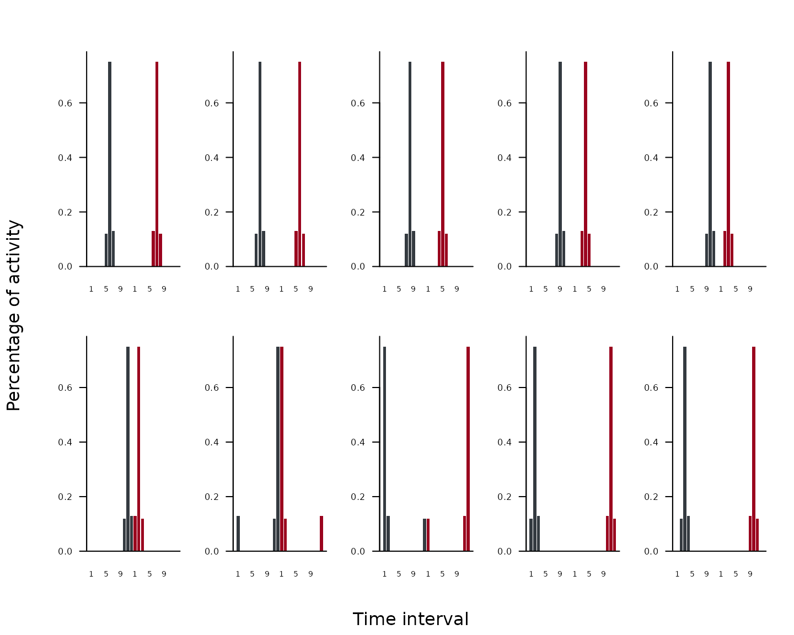
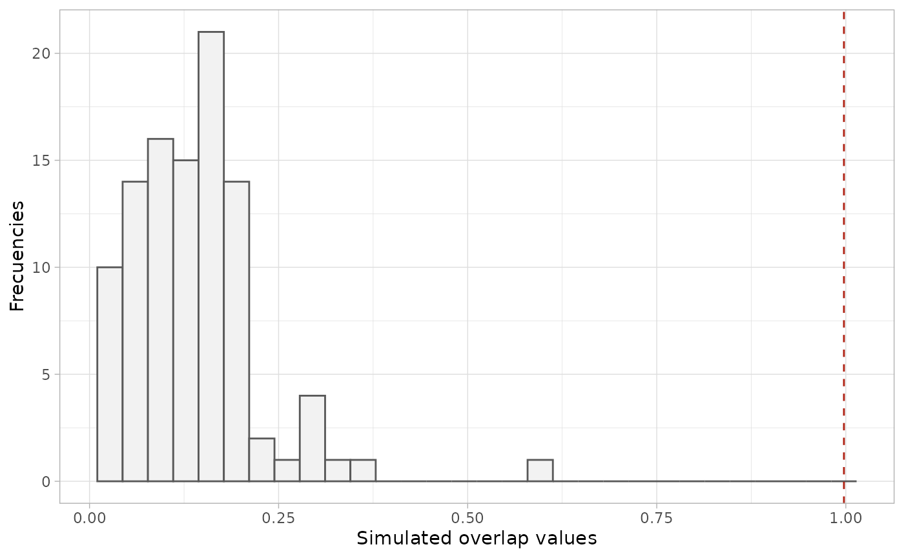

# Introduction to rosario

``` r
library(rosario)
```

## 1. Description of the package

The `rosario` package implements a null model analysis to quantify
concurrent temporal niche overlap (i.e., activity or phenology) among
biological identities (e.g., individuals, populations, or species) using
the Rosario randomization algorithm (Castro-Arellano et al. 2010).

This vignette introduces the main functions and a typical workflow.

## 2. Hypothetical example dataset

The package includes an example dataset, `ex1`, with 5 biological
identities across 12 time intervals. Time intervals are assumed to be
circular (e.g., hours of the day, months of the year), so the last
interval is treated as adjacent to the first.

Values represent counts of activity events (e.g., detections or
captures) per interval.

``` r
data("ex1")
ex1
#>      INT1 INT2 INT3 INT4 INT5 INT6 INT7 INT8 INT9 INT10 INT11 INT12
#> spp1    0    0    0    0   12   75   13    0    0     0     0     0
#> spp2    0    0    0    0   15   78    7    0    0     0     0     0
#> spp3    0    0    0    0   12   79    9    0    0     0     0     0
#> spp4    0    0    0    0   10   80   10    0    0     0     0     0
#> spp5    0    0    0    0    7   81   12    0    0     0     0     0
```

The `rosario` function creates the set of cyclic shifts and their mirror
images (reverse order), preserving shape while changing location along
the cycle and maintaining temporal autocorrelation. The suite of vectors
and mirrors represent a complete set of possible distributions.

``` r
rosario_shifts <- rosario(ex1[1, ])
head(rosario_shifts)
#> [[1]]
#>  INT1  INT2  INT3  INT4  INT5  INT6  INT7  INT8  INT9 INT10 INT11 INT12 INT12 
#>     0     0     0     0    12    75    13     0     0     0     0     0     0 
#> INT11 INT10  INT9  INT8  INT7  INT6  INT5  INT4  INT3  INT2  INT1 
#>     0     0     0     0    13    75    12     0     0     0     0 
#> 
#> [[2]]
#> INT12  INT1  INT2  INT3  INT4  INT5  INT6  INT7  INT8  INT9 INT10 INT11 INT11 
#>     0     0     0     0     0    12    75    13     0     0     0     0     0 
#> INT10  INT9  INT8  INT7  INT6  INT5  INT4  INT3  INT2  INT1 INT12 
#>     0     0     0    13    75    12     0     0     0     0     0 
#> 
#> [[3]]
#> INT11 INT12  INT1  INT2  INT3  INT4  INT5  INT6  INT7  INT8  INT9 INT10 INT10 
#>     0     0     0     0     0     0    12    75    13     0     0     0     0 
#>  INT9  INT8  INT7  INT6  INT5  INT4  INT3  INT2  INT1 INT12 INT11 
#>     0     0    13    75    12     0     0     0     0     0     0 
#> 
#> [[4]]
#> INT10 INT11 INT12  INT1  INT2  INT3  INT4  INT5  INT6  INT7  INT8  INT9  INT9 
#>     0     0     0     0     0     0     0    12    75    13     0     0     0 
#>  INT8  INT7  INT6  INT5  INT4  INT3  INT2  INT1 INT12 INT11 INT10 
#>     0    13    75    12     0     0     0     0     0     0     0 
#> 
#> [[5]]
#>  INT9 INT10 INT11 INT12  INT1  INT2  INT3  INT4  INT5  INT6  INT7  INT8  INT8 
#>     0     0     0     0     0     0     0     0    12    75    13     0     0 
#>  INT7  INT6  INT5  INT4  INT3  INT2  INT1 INT12 INT11 INT10  INT9 
#>    13    75    12     0     0     0     0     0     0     0     0 
#> 
#> [[6]]
#>  INT8  INT9 INT10 INT11 INT12  INT1  INT2  INT3  INT4  INT5  INT6  INT7  INT7 
#>     0     0     0     0     0     0     0     0     0    12    75    13    13 
#>  INT6  INT5  INT4  INT3  INT2  INT1 INT12 INT11 INT10  INT9  INT8 
#>    75    12     0     0     0     0     0     0     0     0     0
```

## 3. Visualize patterns generated by `rosario()` function

Use
[`plot_rosario()`](https://alrobles.github.io/rosario/reference/plot_rosario.md)
to visualize hypothetical time-use distributions produced by
[`rosario()`](https://alrobles.github.io/rosario/reference/rosario.md)
for a single biological identity. The function plots the first 10
hypothetical set of cyclic shifts and their mirror images. Each panel
shows one hypothetical time-use distribution, with the cyclic shift in
dark gray and its mirror image in dark red.

``` r
plot_rosario(ex1[1, ], cols = 5)
```



## 4. Assemblage-wide overlap

Use
[`temp_overlap()`](https://alrobles.github.io/rosario/reference/temp_overlap.md)
to compute the mean of all pairwise overlaps among rows (biological
identities), using the chosen index: “pianka” or “czekanowski”. This
returns the observed assemblage-wide overlap.

This assemblage-wide summary is most informative when you have three or
more biological identities (e.g., individuals, species, or communities),
because it captures overall overlap rather than only pairwise
comparisons.

``` r
temp_overlap(ex1, method = "pianka")
#>    pianka 
#> 0.9975192

# or

temp_overlap(ex1, method = "czekanowski")
#> czekanowski 
#>       0.953
```

## 5. Null Model Test

To test whether the observed overlap differs from random expectations,
[`get_null_model()`](https://alrobles.github.io/rosario/reference/get_null_model.md)
generates a null distribution of assemblage-wide overlap by repeatedly
randomizing the input matrix using
[`rosario_sample()`](https://alrobles.github.io/rosario/reference/rosario_sample.md)
and recomputing mean pairwise overlap (via
[`temp_overlap()`](https://alrobles.github.io/rosario/reference/temp_overlap.md)).

[`get_null_model()`](https://alrobles.github.io/rosario/reference/get_null_model.md)
can run simulations in parallel by setting `parallel = TRUE` to reduce
runtime on multicore machines. For CRAN checks and maximum portability,
this vignette uses `parallel = FALSE`.

We recommend using `nsim = 1000` for applied analyses, but runtime
depends on hardware and dataset size.

``` r
set.seed(1)
mod <- get_null_model(ex1, method = "pianka", nsim = 100, parallel = FALSE)
mod$p_value
#> 
#>  One Sample t-test
#> 
#> data:  res[[1]]
#> t = -100.15, df = 99, p-value < 2.2e-16
#> alternative hypothesis: true mean is not equal to 0.9975192
#> 95 percent confidence interval:
#>  0.1202562 0.1543425
#> sample estimates:
#> mean of x 
#> 0.1372993
```

## 6. Visualizing the null distribution

Use
[`temp_overlap_plot()`](https://alrobles.github.io/rosario/reference/temp_overlap_plot.md)
to compare the observed overlap (from
[`temp_overlap()`](https://alrobles.github.io/rosario/reference/temp_overlap.md))
against the simulated null distribution (from
[`get_null_model()`](https://alrobles.github.io/rosario/reference/get_null_model.md)).
The plot shows a histogram of simulated overlap values and a vertical
dashed line indicating the observed overlap.

``` r
temp_overlap_plot(mod)
#> `stat_bin()` using `bins = 30`. Pick better value `binwidth`.
```



## 7. Conclusion

This vignette demonstrates the key steps in a temporal niche overlap
analysis workflow using `rosario`.

For more details on each function, see the package documentation and the
examples in each function’s help page.
